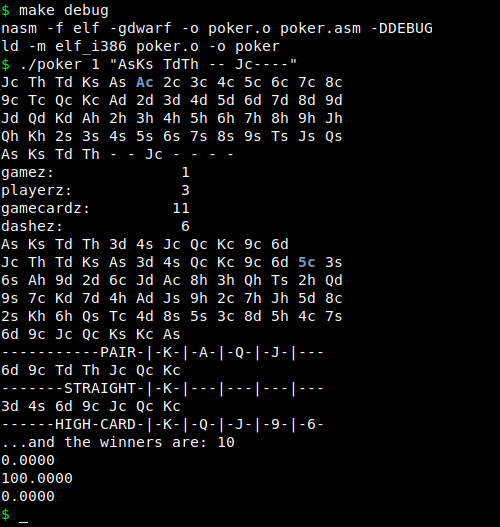
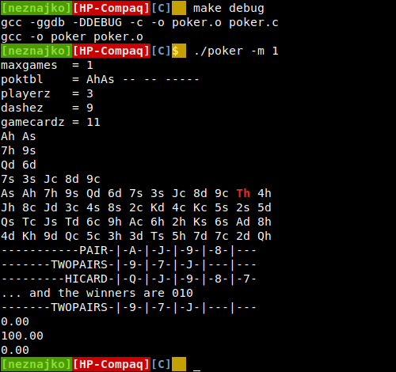
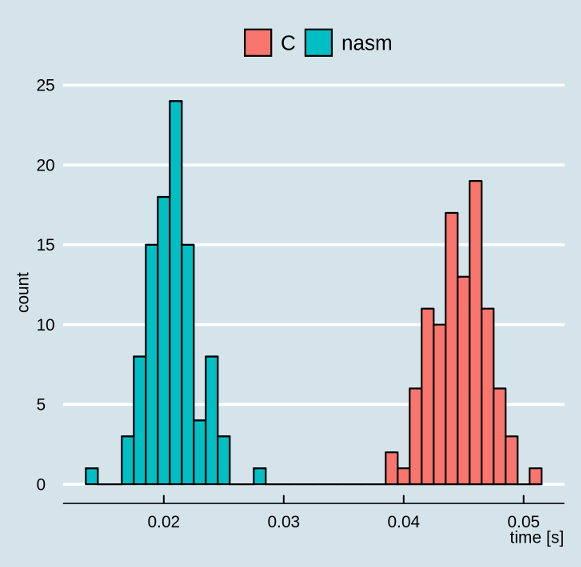
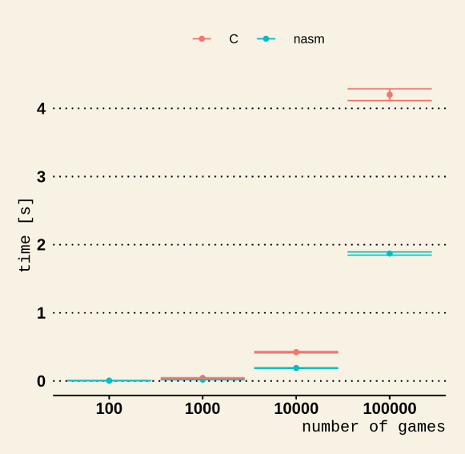

# poker
*Texas Hold'em* calculator

---
Have you wonder, when watching poker, how the winning percentages are immediately  
known for *every* possible situation? The following **Monte Carlo** aims to give a hint answering  
that question.

The program is writen in two languages. **Nasm**, without using external libraries, and **C**  
for speed and comparison considerations respectively.

### The Algorithm
The problem is not very difficult but also not very trivial, without going in details about  
data structures and so, program flow can be described as follows (*Knuth* style):
 
 **P1.** [Initialise.]  Parse arguments, initialize data, reset deck etc.
 
 **P2.** [Shuffle.] Shuffle the deck.
 
 **P3.** [Cards?] Check if there are enough cards left in the deck, if no jump to P7.
 
 **P4.** [Deal.] Deal some cards.
 
 **P5.** [Count.] Count winners. This is the essensial part of the program it generates all  
 possible combinations from *pocket* and *community* cards to find players' hands and than  
 the winner (or the winners, see **Notes**).
 
 **P6.** [Done?] Increment number of games. If maximun limit is reached, output the result and  
 terminate the program, otherwise jump to P3.
 
 **P7.** [Reset] Reset deck pointer and jump to P2.
 
### Nasm
It is **32 Bit x86** assembly code but it will run on a 64 Bit machine as well. We can pass two arguments at command line; the maximum number of Monte Carlo simulations, that is the maximum number of games and a string with cards initiailzing players' pocket and community cards. Each card is represented with two characters; the rank *2, 3, 4, 5, 6, 7, 8, 9, T, J, Q, K, A*, and the suit *c, d, h, s*, empty cards are marked with dashes.

Let's for example look at the debugging output for one game.

Here the first player has *Kalashnikov*, the second player has *Dynamite*, the third player may have any cards, and the first card on the turn is a *Jack* of *clubs*. We call these cards *scenario cards*, they are put in front of the *deck* and the ==*deck pointer*== is set accordingly after them.

 The cards just before the second dump of the deck are called *gamecards* and are used for building players' hands by generating all possible combinations between pocket and community cards and pickinig the hand with maximum rank.
 
 Than the win counter for the player with maximum hand rank is increaced until number of game limit is reached. *(If you wonder what winner 10 means the winners are represented as bit positions coz of the split win see **Notes**)*
 
### C
Basically it's the same except some minor differences, like variable names, command line options etc. The main reason for writing the code in C as well is coz was curious about time performance comparison.

### R
In *R* subdirectory there are two **R** files, the first one for building a data frame with 100 time measurments for different number of Monte Carlo simulations, and the second one for ploting the results. Basically **nasm** is two times faster than **C** but bellow 1000 games there is practicaly no difference. Here are the plots (the distribution is for 1000 games):

### Notes
As you know the result of a poker game might be a tie, that is a split win. For some reason decided that in this case will count every player as a winner, and not introducing separate tie counter. For example the winning percentages for two players will be over 100% let's say 135% in this case 35% of the games are tie.
